# Local Ticket Manager (ltm) - Architecture Documentation

## Table of Contents

1. [System Overview](#system-overview)
2. [High-Level Architecture](#high-level-architecture)
3. [Component Architecture](#component-architecture)
4. [Data Flow](#data-flow)
5. [Database Design](#database-design)
6. [Module Dependencies](#module-dependencies)
7. [Technology Stack](#technology-stack)
8. [Developer Onboarding](#developer-onboarding)
9. [Testing Strategy](#testing-strategy)
10. [Security & Performance](#security--performance)
11. [Extension Points](#extension-points)
12. [Future Roadmap](#future-roadmap)

## System Overview

The Local Ticket Manager (ltm) is a Rust-based command-line application designed for personal workflow management through a ticket-based system. It emphasizes:

- **Local-first**: All data stored locally in SQLite
- **Fast**: Built with Rust for optimal performance
- **User-friendly**: Rich CLI with validation, suggestions, and formatting
- **Extensible**: Modular architecture for easy enhancement

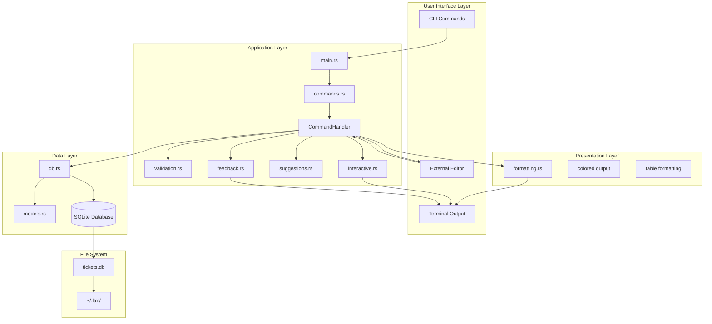

## High-Level Architecture

### Layered Architecture Pattern

The application follows a clean layered architecture with clear separation of concerns:

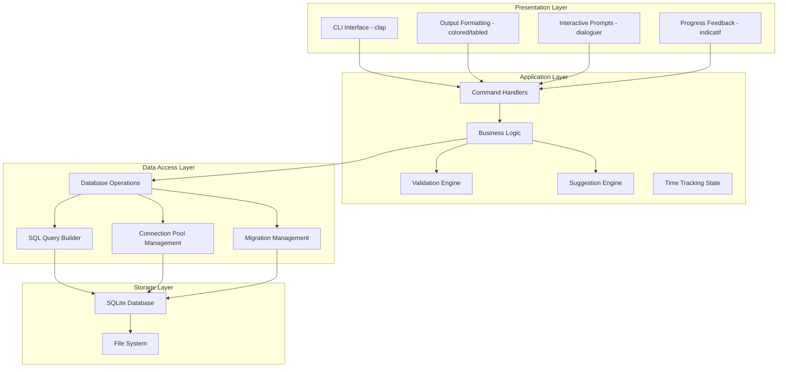

## Component Architecture

### Core Components

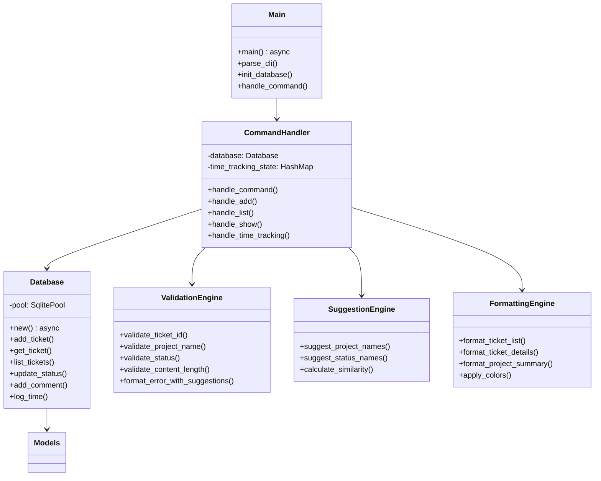

### Data Models

```mermaid
classDiagram
    class Ticket {
        +i64 id
        +String project
        +String name
        +String description
        +String status
        +NaiveDateTime created_at
        +NaiveDateTime updated_at
    }

    class Comment {
        +i64 id
        +i64 ticket_id
        +String content
        +NaiveDateTime created_at
    }

    class TimeLog {
        +i64 id
        +i64 ticket_id
        +i32 hours
        +i32 minutes
        +Option~NaiveDateTime~ started_at
        +Option~NaiveDateTime~ ended_at
        +NaiveDateTime created_at
    }

    class ProjectSummary {
        +String project
        +i64 total_tickets
        +i64 open_tickets
        +i64 closed_tickets
        +f64 total_time_hours
    }

    Ticket ||--o{ Comment : "has many"
    Ticket ||--o{ TimeLog : "tracks time"
    Ticket }o--|| ProjectSummary : "aggregates to"
```

## Data Flow

### Command Processing Flow

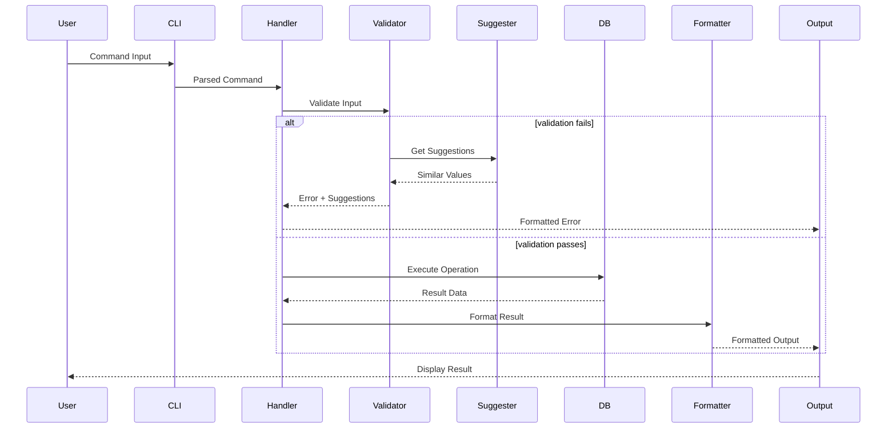

### Time Tracking Flow

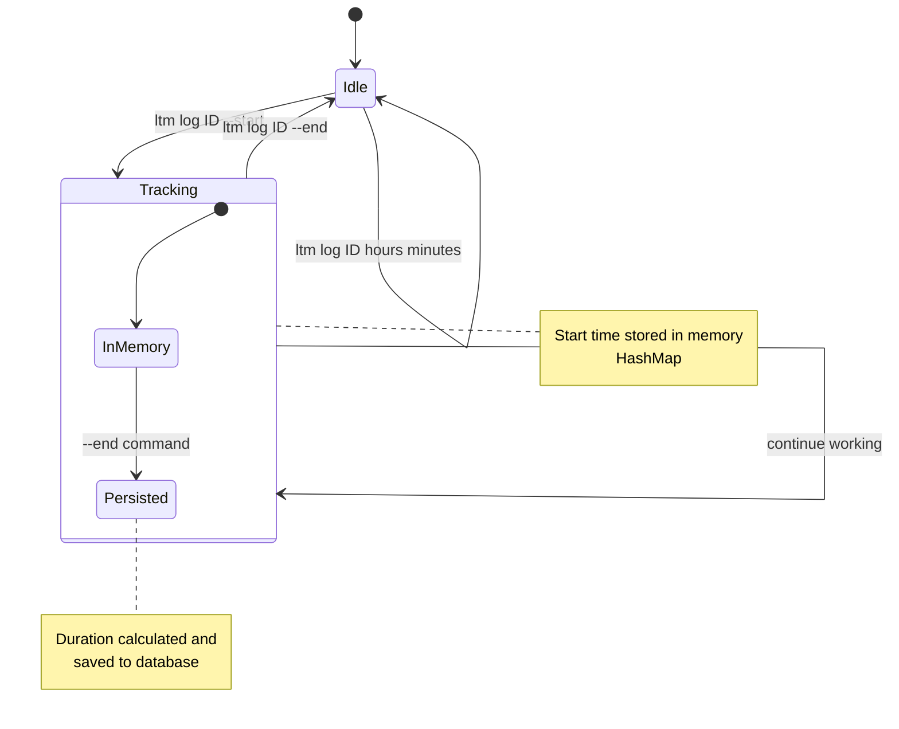

### Database Operations Flow

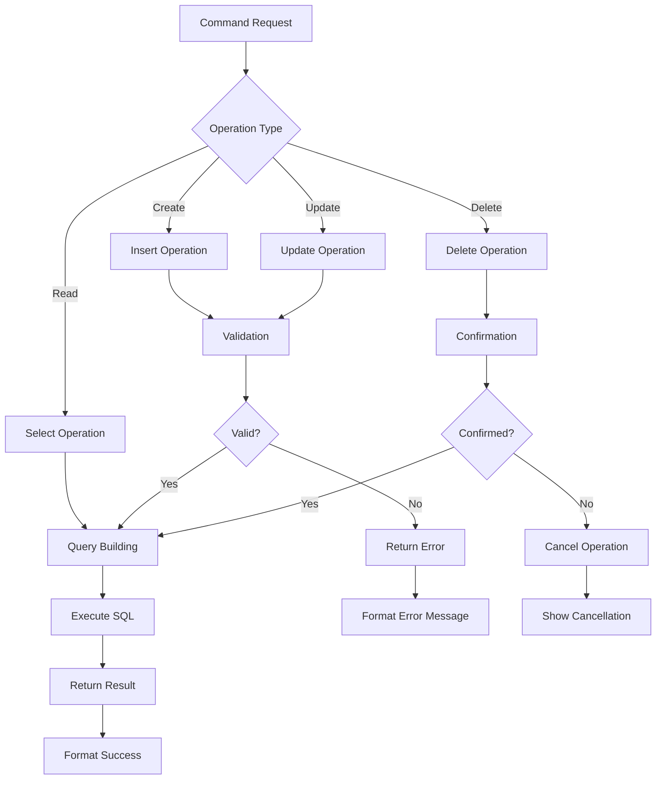

## Database Design

### Entity Relationship Diagram

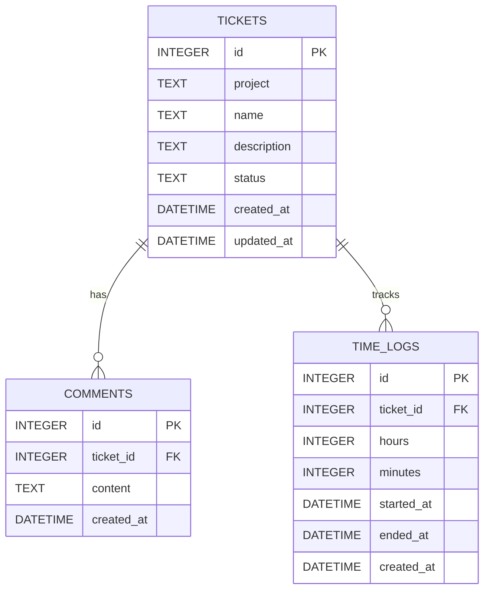

### Database Schema Details

#### Tables and Indexes

- **tickets**: Primary entity, indexed on `project` and `status`
- **comments**: Linked to tickets, indexed on `ticket_id`
- **time_logs**: Time tracking data, indexed on `ticket_id` and `created_at`

#### Data Integrity

- Foreign key constraints ensure referential integrity
- NOT NULL constraints on essential fields
- Check constraints on time values (hours: 0-24, minutes: 0-59)

## Module Dependencies

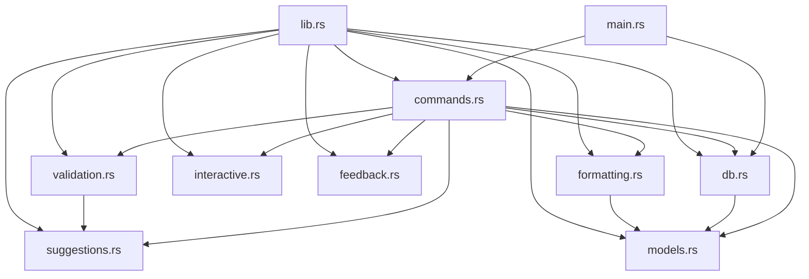

### Module Responsibilities

| Module | Responsibility | Key Dependencies |
|--------|---------------|------------------|
| `main.rs` | Application entry point, CLI parsing | clap, tokio |
| `commands.rs` | Command handling and orchestration | All other modules |
| `db.rs` | Database operations and connection management | sqlx, dirs |
| `models.rs` | Data structures and serialization | serde, sqlx |
| `validation.rs` | Input validation and error handling | regex, thiserror |
| `formatting.rs` | Output formatting and styling | tabled, colored |
| `interactive.rs` | User interaction and confirmations | dialoguer |
| `suggestions.rs` | Smart suggestions for typos | strsim |
| `feedback.rs` | Progress indication and user feedback | indicatif |

## Technology Stack

### Core Technologies

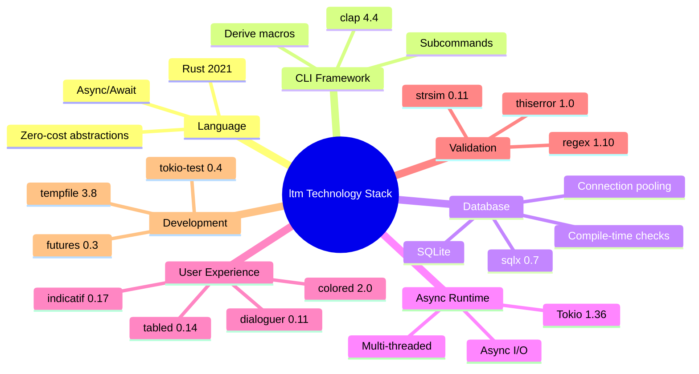

### Dependency Management

The project uses Cargo.toml with carefully selected dependencies:

- **Core**: Minimal essential dependencies
- **CLI**: Rich user interface components
- **Database**: SQLite with compile-time safety
- **Error Handling**: Comprehensive error management
- **Testing**: Robust testing infrastructure

## Developer Onboarding

### Quick Start for Developers

1. **Prerequisites**
   ```bash
   # Install Rust
   curl --proto '=https' --tlsv1.2 -sSf https://sh.rustup.rs | sh
   
   # Install SQLite (usually pre-installed)
   # macOS: brew install sqlite
   # Ubuntu: apt-get install sqlite3 libsqlite3-dev
   ```

2. **Setup Development Environment**
   ```bash
   git clone <repository>
   cd ltm
   
   # Build with offline mode for sqlx
   SQLX_OFFLINE=true cargo build
   
   # Run tests
   SQLX_OFFLINE=true cargo test
   
   # Install locally for testing
   cargo install --path .
   ```

3. **Development Workflow**
   ```bash
   # Format code
   cargo fmt
   
   # Check linting
   cargo clippy
   
   # Run specific tests
   cargo test validation
   
   # Build release
   SQLX_OFFLINE=true cargo build --release
   ```

### Understanding the Codebase

#### Entry Points
- Start with `main.rs` to understand application flow
- Examine `commands.rs` for command definitions
- Study `models.rs` for data structures

#### Key Patterns
- **Error Handling**: Uses `anyhow::Result` throughout
- **Async/Await**: Database operations are async
- **Validation**: Comprehensive input validation with suggestions
- **Testing**: Integration tests with in-memory SQLite

#### Code Organization
```
src/
├── main.rs          # Entry point, CLI setup
├── lib.rs           # Public module exports
├── commands.rs      # Command definitions and handlers
├── db.rs           # Database operations
├── models.rs       # Data structures
├── validation.rs   # Input validation
├── formatting.rs   # Output formatting
├── interactive.rs  # User interactions
├── suggestions.rs  # Smart suggestions
└── feedback.rs     # Progress indicators
```

### Adding New Features

#### Adding a New Command
1. Add command to `Commands` enum in `commands.rs`
2. Add handler method in `CommandHandler`
3. Add database operations in `db.rs` if needed
4. Add validation rules in `validation.rs`
5. Add formatting in `formatting.rs`
6. Add tests in `tests/`

#### Adding Database Fields
1. Update migration in `migrations/`
2. Update models in `models.rs`
3. Update database operations in `db.rs`
4. Update formatting in `formatting.rs`
5. Add validation if needed

## Testing Strategy

### Test Architecture

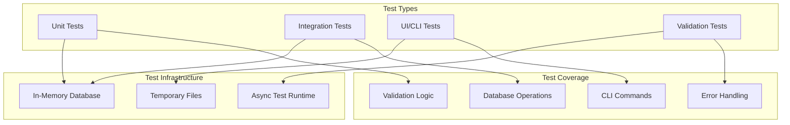

### Test Categories

1. **Unit Tests**: Individual function testing
2. **Integration Tests**: Database and command integration
3. **UI Tests**: CLI interface testing
4. **Validation Tests**: Input validation scenarios

### Running Tests

```bash
# All tests
SQLX_OFFLINE=true cargo test

# Specific test file
SQLX_OFFLINE=true cargo test integration_tests

# With output
SQLX_OFFLINE=true cargo test -- --nocapture

# Test coverage
cargo tarpaulin --out Html
```

## Security & Performance

### Security Considerations

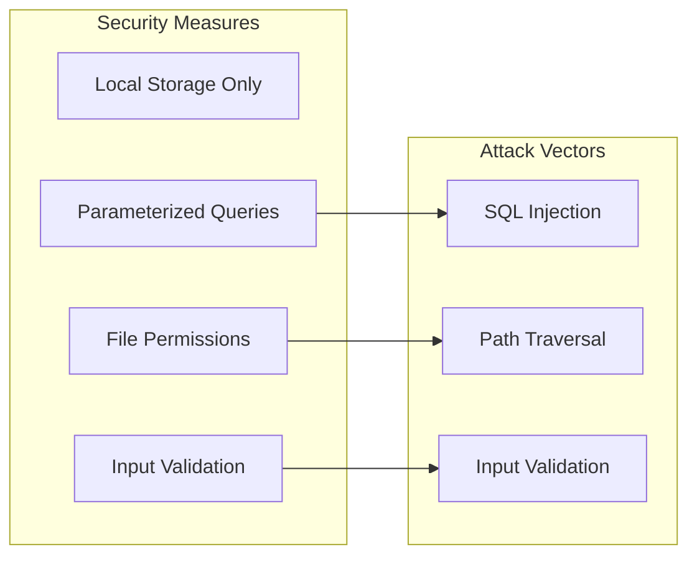

- **SQL Injection Prevention**: sqlx compile-time query checking
- **Local Data**: No network exposure reduces attack surface
- **Input Sanitization**: Comprehensive validation
- **File Security**: Proper permissions on database file

### Performance Optimizations

- **Connection Pooling**: Efficient database connections
- **Indexing**: Strategic database indexes
- **Memory Management**: Rust's zero-cost abstractions
- **Async I/O**: Non-blocking operations

## Extension Points

### Architecture Extension Points

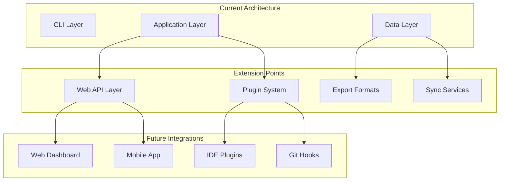

### Implementation Strategies

1. **Web API**: Add HTTP layer with same command handlers
2. **Plugin System**: Dynamic command loading
3. **Export System**: Multiple format support (JSON, CSV, PDF)
4. **Sync Services**: Cloud backup and team collaboration

## Future Roadmap

### Short-term Enhancements (1-3 months)

- [ ] Configuration file support (TOML/YAML)
- [ ] Export functionality (JSON, CSV)
- [ ] Advanced filtering and search
- [ ] Bash/Zsh completion scripts

### Medium-term Features (3-6 months)

- [ ] Web dashboard interface
- [ ] Time tracking analytics and reports
- [ ] Git integration (commit linking)
- [ ] Template system for tickets

### Long-term Vision (6+ months)

- [ ] Team collaboration features
- [ ] Mobile companion app
- [ ] IDE plugin ecosystem
- [ ] AI-powered ticket suggestions

### Migration Strategy

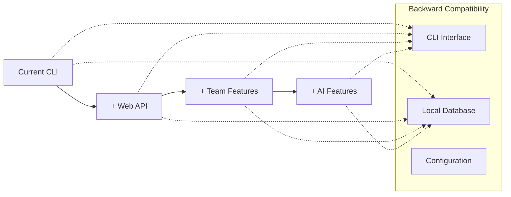

---

## Conclusion

The Local Ticket Manager represents a well-architected Rust application that balances simplicity with extensibility. Its modular design, comprehensive testing, and focus on user experience make it an excellent foundation for future enhancements while maintaining the core philosophy of local-first, fast, and user-friendly workflow management.

The architecture supports both individual productivity and potential team collaboration, with clear extension points for web interfaces, mobile apps, and third-party integrations.