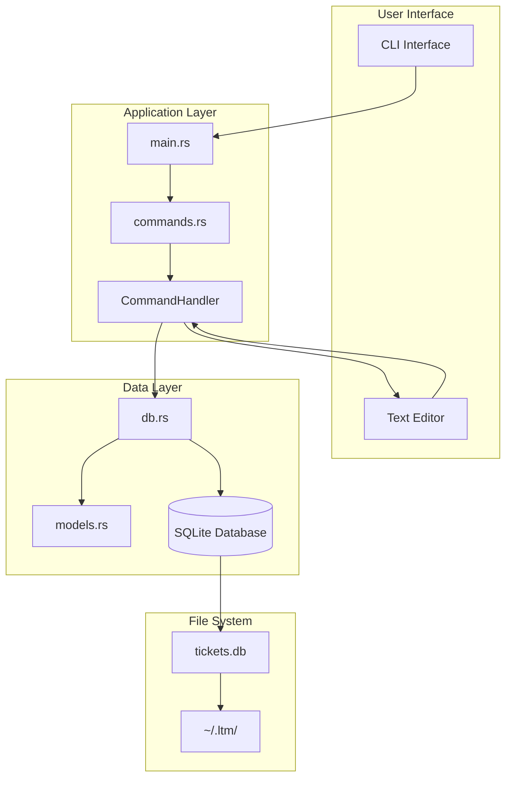
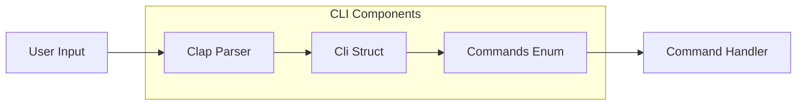
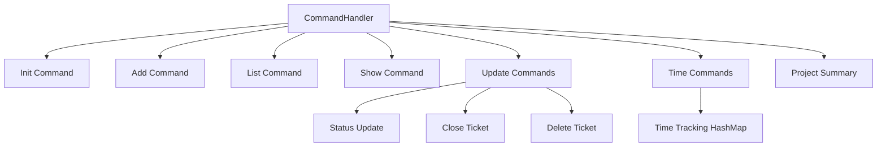
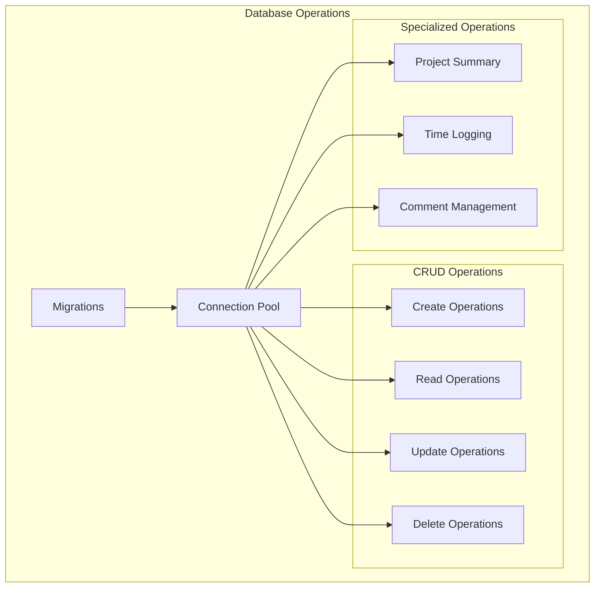
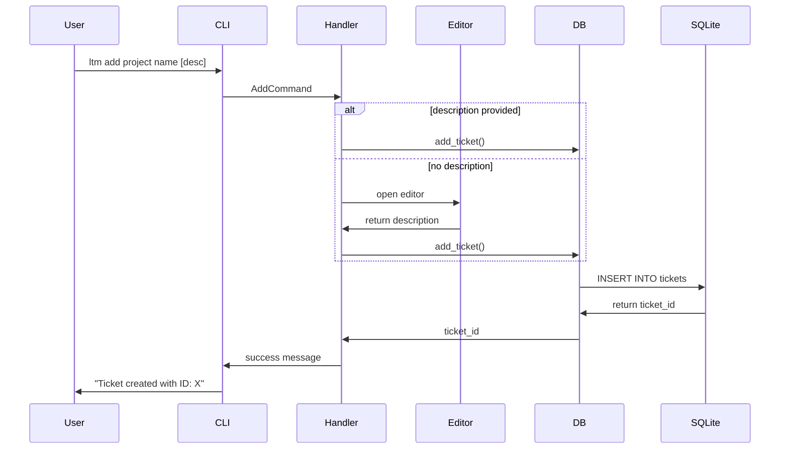
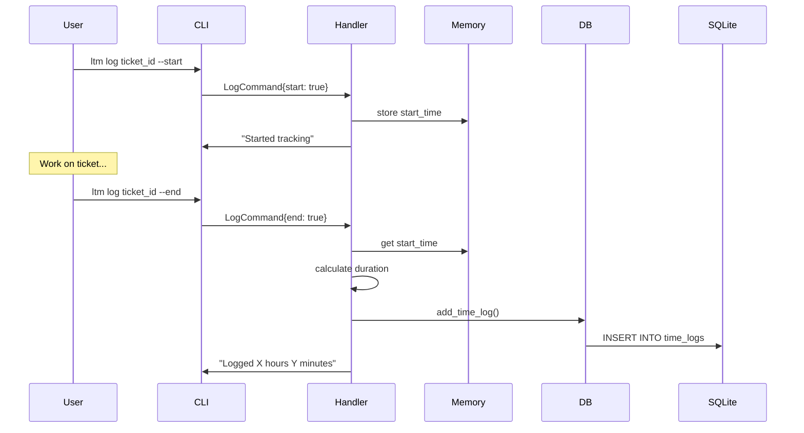
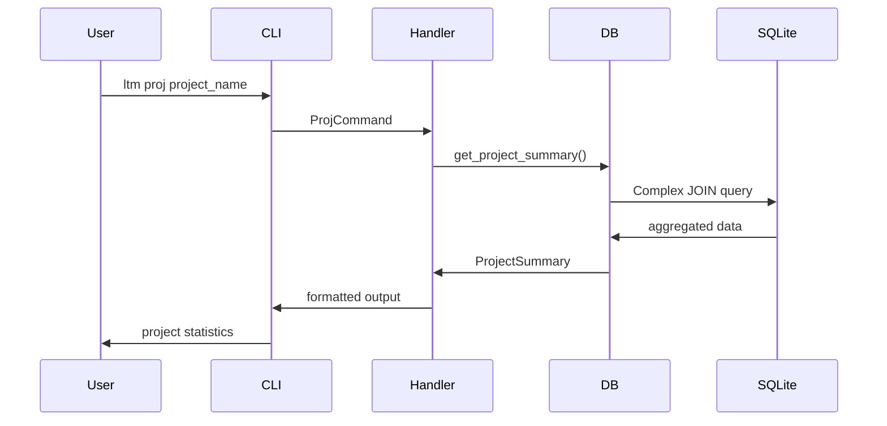
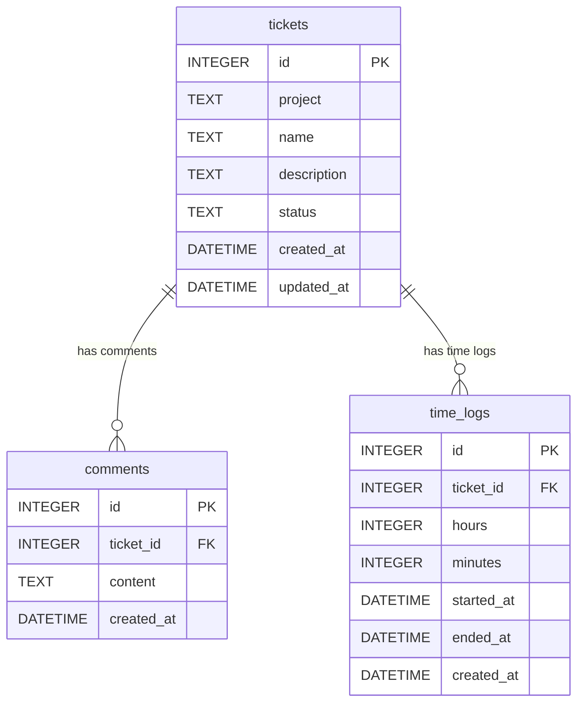
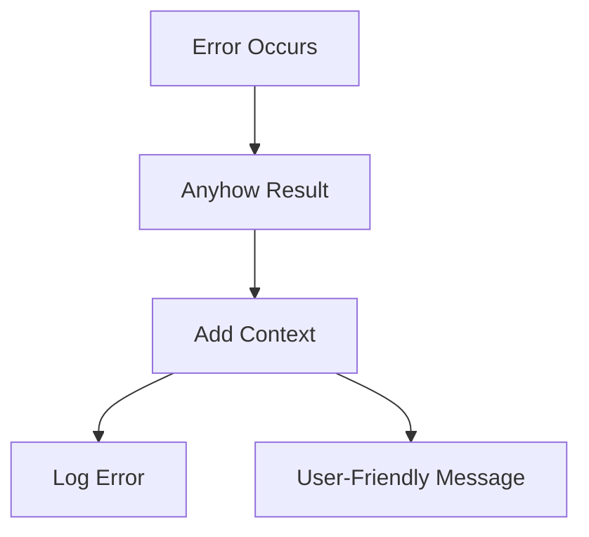

# Local Ticket Manager (ltm) - Architecture Documentation

## System Overview

The Local Ticket Manager (ltm) is a command-line application built with Rust that provides personal workflow management through a ticket-based system. The application stores all data locally in an SQLite database and offers comprehensive time tracking capabilities.

## High-Level Architecture



## Component Architecture

### 1. CLI Interface Layer (`main.rs`, `commands.rs`)

The CLI layer handles user input parsing and command routing using the `clap` crate.



**Responsibilities:**

- Parse command-line arguments
- Validate input parameters
- Route commands to appropriate handlers
- Display help and error messages

### 2. Command Handler (`commands.rs`)

The command handler processes parsed CLI commands and coordinates with the database layer.



**Key Features:**

- In-memory time tracking for start/stop functionality
- Editor integration for ticket descriptions
- Command validation and error handling

### 3. Database Layer (`db.rs`)

The database layer provides an abstraction over SQLite operations using `sqlx`.



### 4. Data Models (`models.rs`)

Data models represent the core entities in the system.

```mermaid
classDiagram
    class Ticket {
        +i64 id
        +String project
        +String name
        +String description
        +String status
        +DateTime created_at
        +DateTime updated_at
    }

    class Comment {
        +i64 id
        +i64 ticket_id
        +String content
        +DateTime created_at
    }

    class TimeLog {
        +i64 id
        +i64 ticket_id
        +i32 hours
        +i32 minutes
        +Option~DateTime~ started_at
        +Option~DateTime~ ended_at
        +DateTime created_at
    }

    class ProjectSummary {
        +String project
        +i64 total_tickets
        +i64 open_tickets
        +i64 closed_tickets
        +f64 total_time_hours
    }

    Ticket ||--o{ Comment : has
    Ticket ||--o{ TimeLog : tracks
    Ticket }o--|| ProjectSummary : aggregates
```

## Data Flow Diagrams

### 1. Ticket Creation Flow



### 2. Time Tracking Flow



### 3. Project Summary Flow



## Database Schema



## File System Structure

```
~/.ltm/
└── tickets.db          # SQLite database file

<project_root>/
├── src/
│   ├── main.rs          # Application entry point
│   ├── commands.rs      # CLI command definitions and handlers
│   ├── db.rs           # Database operations and connection
│   └── models.rs       # Data structure definitions
├── migrations/
│   └── 20240320000000_initial.sql  # Database schema
├── Cargo.toml          # Project dependencies
├── design.md           # Project requirements
├── design_steps.md     # Feature checklist
├── architecture.md     # This document
└── README.md           # User documentation
```

## Security Considerations

1. **Local Storage**: All data is stored locally, reducing external attack vectors
2. **Input Validation**: Need to implement proper validation for user inputs
3. **SQL Injection**: Using parameterized queries via sqlx prevents SQL injection
4. **File Permissions**: Database file should have appropriate permissions

## Performance Considerations

1. **Connection Pooling**: Using sqlx connection pool for efficient database access
2. **Indexing**: Consider adding indexes for frequently queried columns
3. **Memory Usage**: Time tracking state is stored in memory (limitation for persistence)
4. **Query Optimization**: Aggregate queries for project summaries could be optimized

## Error Handling Strategy



## Extension Points

1. **Command Plugins**: New commands can be added to the Commands enum
2. **Database Backends**: Abstract database trait could support multiple backends
3. **Export Formats**: Additional data export functionality
4. **Configuration**: TOML/YAML configuration file support
5. **Web Interface**: HTTP API layer for web-based interface

## Technology Stack

- **Language**: Rust 2021 Edition
- **CLI Framework**: clap 4.4
- **Database**: SQLite via sqlx 0.7
- **Async Runtime**: Tokio 1.36
- **Error Handling**: anyhow 1.0
- **Date/Time**: chrono 0.4
- **Editor Integration**: edit 0.1
- **Serialization**: serde 1.0

## Future Enhancements

1. **Web Dashboard**: Browser-based interface for ticket management
2. **Team Collaboration**: Multi-user support with synchronization
3. **Reporting**: Advanced analytics and reporting features
4. **Integrations**: Git hooks, IDE plugins, calendar integration
5. **Mobile App**: Companion mobile application
6. **Backup/Sync**: Cloud backup and synchronization options
