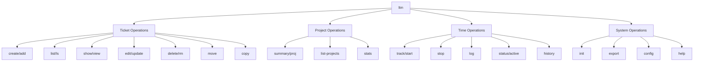

# Local Ticket Manager (ltm) - UX Improvements Plan

## Table of Contents

1. [Current Command Analysis](#current-command-analysis)
2. [Identified Issues](#identified-issues)
3. [Proposed Command Structure](#proposed-command-structure)
4. [Implementation Roadmap](#implementation-roadmap)
5. [Migration Strategy](#migration-strategy)
6. [User Experience Enhancements](#user-experience-enhancements)

## Current Command Analysis

### Existing Commands Overview

| Command | Purpose | Arguments | Issues |
|---------|---------|-----------|--------|
| `ltm init` | Initialize database | None | ✅ Good |
| `ltm add <project> <name> [desc]` | Create ticket | project, name, optional desc | Inconsistent argument order |
| `ltm close <id> <status> [--force]` | Close ticket | ticket_id, status, force flag | Overlaps with `status` |
| `ltm status <id> <status> [--force]` | Update status | ticket_id, status, force flag | Redundant with `close` |
| `ltm delete <id> [--force]` | Delete ticket | ticket_id, force flag | ✅ Good |
| `ltm list [project]` | List tickets | optional project filter | Limited filtering |
| `ltm show <id>` | Show details | ticket_id | ✅ Good |
| `ltm comment <id> <content>` | Add comment | ticket_id, content | No comment management |
| `ltm log <id> [h] [m] [--start\|--end]` | Time tracking | ticket_id, time or flags | Complex time interface |
| `ltm proj <project>` | Project summary | project name | Abbreviated command name |

### Command Usage Patterns

**Most Common Workflows:**
1. Create ticket → Work on it → Update status → Close
2. List tickets → Show details → Comment → Log time
3. Project overview → Filter tickets → Track progress

**Pain Points:**
- Two commands for status updates (`close` vs `status`)
- Complex time tracking interface
- No shortcut commands for common actions
- Inconsistent argument ordering
- Limited search and filtering capabilities

## Identified Issues

### 1. Command Naming Inconsistencies

**Problems:**
- `close` vs `status` - both update ticket status
- `proj` vs full word commands
- Inconsistent verb usage (`add` vs `comment`)

**Impact:** Cognitive load, command discoverability

### 2. Missing CRUD Operations

**Tickets:**
- ❌ No edit ticket name/description
- ❌ No move between projects
- ❌ No duplicate/copy tickets

**Comments:**
- ❌ No edit comments
- ❌ No delete comments
- ❌ No list comments separately

**Time Logs:**
- ❌ No edit time entries
- ❌ No delete time entries
- ❌ No list time logs separately

### 3. Argument Inconsistencies

**Current Issues:**
```bash
ltm add <project> <name>        # Project first
ltm show <ticket_id>            # ID first
ltm comment <ticket_id> <text>  # ID first
```

**Should be consistent:** Always ticket ID first for ticket operations

### 4. Missing Workflow Commands

**Common Patterns Not Supported:**
- No "start working" command
- No "finish/complete" shortcuts
- No priority management
- No due date support
- No assignment (even for personal productivity)

### 5. Time Tracking UX Issues

**Current Problems:**
```bash
ltm log 1 --start     # Start tracking
ltm log 1 --end       # Stop tracking
ltm log 1 2 30        # Manual entry
```

**Issues:**
- No way to see active timers
- No way to cancel active tracking
- No pause/resume functionality
- Manual time entry is verbose

### 6. Search and Filter Limitations

**Missing Features:**
- No text search in tickets/comments
- No status-based filtering
- No date range filtering
- No sorting options
- No advanced queries

### 7. Bulk Operations Missing

**Not Supported:**
- Bulk status updates
- Bulk project moves
- Bulk delete operations
- Batch time logging

## Proposed Command Structure

### Core Principles

1. **Consistency**: Ticket ID always first for ticket operations
2. **Clarity**: Clear, descriptive command names
3. **Shortcuts**: Common operations have short aliases
4. **Discoverability**: Help and suggestions guide users
5. **Backward Compatibility**: Existing commands continue to work

### Recommended Command Hierarchy



### New Command Structure

#### 1. Ticket Management (Improved)

```bash
# Create tickets
ltm create <project> <name> [description]     # Main command
ltm add <project> <name> [description]        # Alias (backward compat)
ltm new <project> <name> [description]        # Alias

# List and search
ltm list [options]                            # Enhanced listing
ltm ls [options]                              # Short alias
ltm search <query>                            # Text search
ltm find <query>                              # Alias

# View tickets
ltm show <id>                                 # Existing
ltm view <id>                                 # Alias
ltm info <id>                                 # Alias

# Edit tickets
ltm edit <id> [field]                         # Edit ticket properties
ltm update <id> [field] [value]               # Update specific field
ltm rename <id> <new_name>                    # Rename ticket
ltm move <id> <new_project>                   # Move to project

# Status management
ltm status <id> <status>                      # Update status (keep existing)
ltm open <id>                                 # Quick open
ltm close <id> [status]                       # Close with optional status
ltm complete <id>                             # Mark complete
ltm block <id> [reason]                       # Mark blocked
ltm start <id>                                # Start working (status + timer)

# Copy and delete
ltm copy <id> [new_project]                   # Copy ticket
ltm delete <id>                               # Delete (keep existing)
ltm rm <id>                                   # Alias
```

#### 2. Comments (Enhanced)

```bash
# Add comments
ltm comment <id> <text>                       # Existing
ltm note <id> <text>                          # Alias

# Manage comments
ltm comments <id>                             # List all comments
ltm edit-comment <comment_id> <new_text>      # Edit comment
ltm delete-comment <comment_id>               # Delete comment
```

#### 3. Time Tracking (Redesigned)

```bash
# Active time tracking
ltm track <id>                                # Start tracking (better name)
ltm start <id>                                # Start tracking + update status
ltm stop [id]                                 # Stop tracking (auto-detect if no ID)
ltm pause [id]                                # Pause tracking
ltm resume [id]                               # Resume tracking
ltm cancel [id]                               # Cancel tracking without logging

# Manual time logging
ltm log <id> <duration>                       # e.g., "2h 30m", "1.5h", "90m"
ltm time <id> <hours>h [minutes]m             # Alternative format

# Time management
ltm active                                    # Show active timers
ltm timer                                     # Alias for active
ltm history [id] [options]                    # Time log history
ltm edit-time <log_id> <new_duration>         # Edit time entry
ltm delete-time <log_id>                      # Delete time entry
```

#### 4. Project Operations (Enhanced)

```bash
# Project summaries
ltm project <name>                            # Better than 'proj'
ltm proj <name>                               # Keep for compatibility
ltm summary <name>                            # Alias

# Project management
ltm projects                                  # List all projects
ltm project-stats                             # All project statistics
ltm archive-project <name>                    # Archive project
```

#### 5. Advanced Features (New)

```bash
# Search and filtering
ltm search <query> [--project] [--status] [--date]
ltm filter --status=open --project=webapp
ltm find-text <text>                          # Search in descriptions/comments

# Bulk operations
ltm bulk-status <status> <id1> <id2> ...      # Bulk status update
ltm bulk-move <project> <id1> <id2> ...       # Bulk project move
ltm bulk-delete <id1> <id2> ...               # Bulk delete

# Export and reporting
ltm export [format] [options]                 # Export data (JSON, CSV, etc.)
ltm report [type] [options]                   # Generate reports
ltm stats [project]                           # Detailed statistics

# Configuration
ltm config set <key> <value>                  # Set configuration
ltm config get <key>                          # Get configuration
ltm config list                               # List all settings
```

### Command Options Enhancement

#### Enhanced Listing Options

```bash
ltm list                                      # All tickets
ltm list --project=webapp                     # Filter by project
ltm list --status=open                        # Filter by status
ltm list --assigned-to=me                     # Future: assignment filter
ltm list --priority=high                      # Future: priority filter
ltm list --due-before=2024-12-31             # Future: due date filter
ltm list --sort=updated                       # Sort options
ltm list --format=json                        # Output format
ltm list --limit=10                           # Pagination
```

#### Enhanced Show Options

```bash
ltm show 1                                    # Basic details
ltm show 1 --with-comments                    # Include comments
ltm show 1 --with-time                        # Include time logs
ltm show 1 --full                             # Everything
ltm show 1 --format=json                      # Machine readable
```

## Implementation Roadmap

### Phase 1: Core Command Improvements (1-2 weeks)

**Priority: High**

1. **Command Aliases**
   - Add short aliases: `ls`, `rm`, `new`
   - Maintain backward compatibility

2. **Enhanced Time Tracking**
   - Implement `ltm active` command
   - Improve duration parsing (`2h30m`, `1.5h`)
   - Add `ltm stop` without requiring ID

3. **Better Project Commands**
   - Add `ltm projects` to list all projects
   - Rename `proj` to `project` (keep alias)

**Example Implementation:**
```rust
// In commands.rs
#[derive(Subcommand)]
enum Commands {
    // ... existing commands ...
    
    /// List all projects
    #[command(alias = "projects")]
    Projects,
    
    /// Show active timers
    #[command(alias = "timer")]
    Active,
    
    /// List tickets (enhanced)
    #[command(alias = "ls")]
    List {
        /// Project filter
        #[arg(long)]
        project: Option<String>,
        /// Status filter
        #[arg(long)]
        status: Option<String>,
        /// Sort by field
        #[arg(long, default_value = "updated")]
        sort: String,
    },
}
```

### Phase 2: CRUD Enhancements (2-3 weeks)

**Priority: High**

1. **Ticket Editing**
   - `ltm edit <id>` - interactive editing
   - `ltm update <id> <field> <value>` - direct updates
   - `ltm move <id> <project>` - project changes

2. **Comment Management**
   - `ltm comments <id>` - list comments
   - `ltm edit-comment <comment_id>` - edit comments
   - `ltm delete-comment <comment_id>` - delete comments

3. **Time Log Management**
   - `ltm history <id>` - show time logs
   - `ltm edit-time <log_id>` - edit time entries
   - `ltm delete-time <log_id>` - delete time entries

### Phase 3: Search and Filtering (2-3 weeks)

**Priority: Medium**

1. **Advanced Search**
   - `ltm search <query>` - full-text search
   - `ltm filter` - advanced filtering options
   - Enhanced `list` command with filters

2. **Improved Display**
   - Multiple output formats (JSON, CSV, table)
   - Customizable table columns
   - Pagination for large result sets

### Phase 4: Workflow Enhancements (3-4 weeks)

**Priority: Medium**

1. **Quick Actions**
   - `ltm start <id>` - start working (status + timer)
   - `ltm complete <id>` - mark complete
   - `ltm block <id>` - mark blocked

2. **Bulk Operations**
   - `ltm bulk-status` - bulk status updates
   - `ltm bulk-move` - bulk project moves
   - `ltm bulk-delete` - bulk delete

3. **Export and Reporting**
   - `ltm export` - data export
   - `ltm report` - report generation
   - `ltm stats` - detailed statistics

### Phase 5: Advanced Features (4-6 weeks)

**Priority: Low**

1. **Extended Metadata**
   - Priority levels
   - Due dates
   - Tags/labels
   - Assignments

2. **Configuration System**
   - User preferences
   - Default values
   - Custom aliases

3. **Integration Features**
   - Git integration
   - Calendar integration
   - External tool hooks

## Migration Strategy

### Backward Compatibility

**Guaranteed Compatibility:**
All existing commands will continue to work exactly as before:

```bash
# These will never break
ltm init
ltm add project name description
ltm list
ltm show 1
ltm status 1 closed
ltm delete 1
ltm comment 1 "text"
ltm log 1 2 30
ltm proj myproject
```

**Deprecation Process:**
1. **Phase 1**: Add new commands alongside old ones
2. **Phase 2**: Add deprecation warnings for old commands
3. **Phase 3**: Eventually remove old commands (major version bump)

### User Communication

**Migration Guide Example:**
```bash
# Old way (still works)
ltm proj myproject

# New way (recommended)
ltm project myproject
ltm projects              # New: list all projects

# Old way (still works)  
ltm log 1 --start
ltm log 1 --end

# New way (improved)
ltm start 1               # Start working + timer
ltm stop                  # Auto-detects active timer
ltm active                # See what's running
```

## User Experience Enhancements

### 1. Improved Error Messages

**Current:**
```
Error: Invalid ticket ID '1a'
```

**Improved:**
```
❌ Invalid ticket ID '1a'
💡 Ticket IDs must be numbers. Did you mean:
   • Ticket 1: "Fix login bug"
   • Ticket 10: "Add authentication"
   
Try: ltm show 1
```

### 2. Better Help System

**Command-specific Help:**
```bash
ltm help time                 # Help for time tracking
ltm help workflow             # Common workflows
ltm help shortcuts            # Command aliases
```

**Interactive Help:**
```bash
ltm                          # Show main help
ltm list --help              # Command-specific help
ltm examples                 # Usage examples
```

### 3. Smart Suggestions

**Project Name Suggestions:**
```bash
$ ltm list --project=webap
🤔 No project 'webap' found. Did you mean:
   • webapp (12 tickets)
   • web-api (5 tickets)
```

**Command Suggestions:**
```bash
$ ltm lst
❌ Unknown command 'lst'
💡 Did you mean: ltm list (or ltm ls)
```

### 4. Enhanced Output Formatting

**Rich Status Display:**
```bash
$ ltm list
📋 Tickets

ID  Project  Name                Status      Updated
1   webapp   Fix login bug       🟡 in-progress  2h ago
2   mobile   Add dark mode       🟢 open         1d ago  
3   api      Update docs         ✅ completed    3d ago
```

**Progress Indicators:**
```bash
🔄 Loading tickets...
✅ Found 15 tickets in 3 projects
⏱️  Active timer: Ticket #1 (2h 15m)
```

### 5. Workflow Shortcuts

**Common Patterns:**
```bash
# Start working on a ticket
ltm start 1                   # Sets status to "in-progress" + starts timer

# Finish working
ltm complete 1                # Stops timer + sets status to "completed"

# Quick status updates
ltm open 1                    # Status: open
ltm block 1 "waiting for API" # Status: blocked + comment
```

### 6. Configuration System

**User Preferences:**
```bash
# Set default project
ltm config set default.project webapp

# Set preferred status names
ltm config set status.in-progress "working"
ltm config set status.completed "done"

# Set time format preference
ltm config set time.format "decimal"  # 2.5h instead of 2h 30m
```

### 7. Tab Completion

**Shell Integration:**
```bash
# Install completion
ltm completion bash > ~/.ltm-completion.bash
source ~/.ltm-completion.bash

# Usage
ltm lis<TAB>     → ltm list
ltm show <TAB>   → shows ticket IDs
ltm --pro<TAB>   → --project
```

## Success Metrics

### Usability Improvements

1. **Reduced Cognitive Load**
   - Consistent argument ordering
   - Clear command names
   - Helpful error messages

2. **Faster Workflows**
   - Fewer keystrokes for common actions
   - Smart defaults
   - Batch operations

3. **Better Discoverability**
   - Comprehensive help system
   - Command suggestions
   - Usage examples

### Backward Compatibility

1. **Zero Breaking Changes** in Phase 1-3
2. **Clear Migration Path** for deprecated features
3. **Comprehensive Documentation** for old vs new commands

### Performance

1. **Fast Command Execution** (< 100ms for most operations)
2. **Efficient Search** (indexed database queries)
3. **Responsive Large Datasets** (pagination, lazy loading)

## Conclusion

This improvements plan addresses the major UX issues in the current ltm command structure while maintaining full backward compatibility. The phased approach allows for incremental improvements and user feedback incorporation.

**Key Benefits:**
- ✅ Consistent, intuitive command structure
- ✅ Enhanced workflow support
- ✅ Better error handling and suggestions
- ✅ Comprehensive time tracking improvements
- ✅ Advanced search and filtering capabilities
- ✅ Smooth migration path for existing users

**Next Steps:**
1. Review and prioritize features based on user feedback
2. Create detailed technical specifications for Phase 1
3. Implement core improvements with comprehensive testing
4. Gather user feedback and iterate on the design